# 机器学习大作业

> 朱浩泽 1911530 王子莼 1911575 赵一林 1910874 


## 实验描述

单细胞转录组数据补插。单细胞RNA在表达时，对基因的表达情况进行测量，但在测量时有些部分可能无法准确测出是否表达，便记为0，但也有一部分基因本身就不会表达，即真实值便为0。所以我们要做的工作便是使用DCA对单细胞RNA-seq去噪，即判断哪些部位的基因是因为测量问题而导致的数据值为0的情况，而非实际未表达，并将这一部分的值算出填入相应位置。


## 实验要求

- 基本要求

  将test_data.csv,test_truedata.csv分为测试集和验证集。实现任意补插算法来对数据集data.csv进行补插。使用测试集确定一个较好的模型，并使用验证集验证。针对你的模型和实验写一份报告，并提交源码(说明运行环境)和可执行文件。(建议使用神经网络)

- 中级要求

  在test_data.csv上获得一定效果(dropout率变小，表达差异变小) 。在别人理论的基础上进行一些自己的修改。

- 高级要求

  对于data.csv的补插和生成data.csv的模拟真实数据集相比获得较好效果(dropout率变小，表达差异变小) 。
  
  

## 实验原理

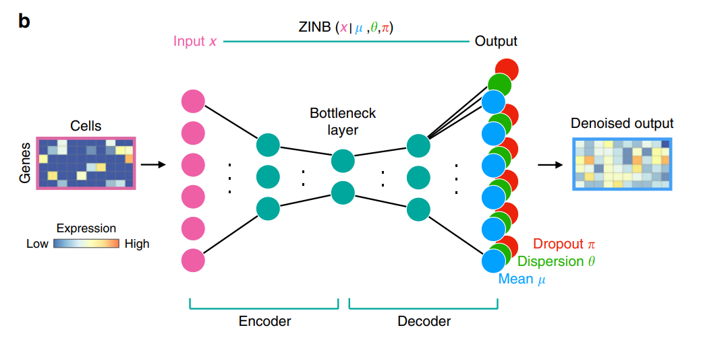

#### 模型构造

```python
class AutoEncoder(nn.Module):
```

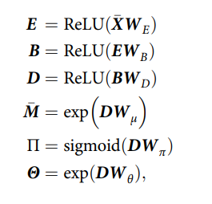

- 输入：计数矩阵A

  $A_{ij}$表示第i个基因在第j个细胞中的表达量

- 隐藏层：

  上图中E，B，D分别代表编码层，瓶颈层和译码层。

  除瓶颈层外所有的隐藏层（也就是编码层和译码层）都包含64个神经元，瓶颈层有32个神经元。

- 输出：每一个基因的三个参数 (μ, θ, π) 即（mean,dispersion,dropout的概率）

  同时也对应着ZINB分布的三个参数


#### 规定每一层的神经元个数

```python
def __init__(self, input_size=None, hasBN=False):
        """
        该autoencoder还可以改进：
        dropout层

        :param input_size:
        """
        super().__init__()
        self.intput_size = input_size
        self.hasBN=hasBN
        self.input = Linear(input_size, 64)
        self.bn1 = BatchNorm1d(64)
        self.encode = Linear(64, 32)
        self.bn2 = BatchNorm1d(32)
        self.decode = Linear(32, 64)
        self.bn3 = BatchNorm1d(64)
        self.out_put_PI = Linear(64, input_size)
        self.out_put_M = Linear(64, input_size)
        self.out_put_THETA = Linear(64, input_size)
        self.reLu = nn.ReLU()
        self.sigmoid = nn.Sigmoid()
```

#### 确定激活函数

THETA和M的激活函数都是exp，因为他们都是非负值

PI使用sigmoid作为激活函数，因为它是所估计的dropout的概率，应该在0和1之间

```python
def forward(self, x):
        x = self.input(x)
        if self.hasBN:x = self.bn1(x)
        x = self.reLu(x)
        x = self.encode(x)
        if self.hasBN:x = self.bn2(x)
        x = self.reLu(x)
        x = self.decode(x)
        if self.hasBN:x = self.bn3(x)
        x = self.reLu(x)
        PI = self.sigmoid(self.out_put_PI(x))
        M = torch.exp(self.out_put_M(x))
        THETA = torch.exp(self.out_put_THETA(x))
        return PI, M, THETA
```

#### 模型的损失函数

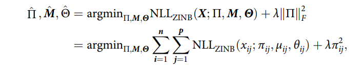

其中NLL是ZINB分布的负对数似然，ZINB公式如下:

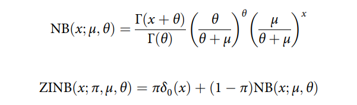

选择ZINB分布是因为scRNA-seq数据的零值非常多，并选取其的负对数似然值作为其损失函数。当损失函数最小，ZINB的似然值最大，概率密度最大。我们要做的所谓训练，就是将损失函数不断降低，直到ZINB的似然值变得较大，此时概率密度较大且意味着概率较大，由此分析获得相对好的补插效果。


损失函数的代码如下：

```python
class LZINBLoss(nn.Module):
    def __init__(self, eps=1e-6):
        super().__init__()
        self.eps = eps

    def forward(self, X: Tensor, PI: Tensor = None, M: Tensor = None, THETA: Tensor = None):
        # 防止出现除0，log(0) log (负数) 等等等
        eps = self.eps
        # deal with inf
        max1 = max(THETA.max(), M.max())
        if THETA.isinf().sum() != 0:
            THETA = torch.where(THETA.isinf(), torch.full_like(THETA, max1), THETA)
        if M.isinf().sum() != 0:
            M = torch.where(M.isinf(), torch.full_like(M, max1), M)


        if PI.isnan().sum() != 0:
            PI = torch.where(PI.isnan(), torch.full_like(PI, eps), PI)
        if THETA.isnan().sum() != 0:
            THETA = torch.where(THETA.isnan(), torch.full_like(THETA, eps), THETA)
        if M.isnan().sum() != 0:
            M = torch.where(M.isnan(), torch.full_like(M, eps), M)

        # for x, pi, miu, theta in zip(X.flatten(), PI.flatten(), M.flatten(), THETA.flatten()):
        #     # zinb = ZINB(x, pi, theta, miu)
        #     # t = t - torch.log(zinb)
        #     lnb = lgamma(x + theta + eps) - lgamma(theta + eps) + \
        #           theta * torch.log((theta + eps) / (miu + theta + eps)) + \
        #           x * torch.log((miu + eps) / (miu + theta + eps))
        #     lnb = torch.where(lnb > 0, torch.full_like(lnb, 0.), lnb)
        #     assert lnb <= 0, 'ln(nb) greater than 0'
        #     nb = torch.exp(lnb)
        #     zinb = (1 - torch.is_nonzero(x)) * pi + (1 - pi) * nb + eps
        #     # python 有链式比较！！！
        #     # 等价于 0 < zinb and zinb <= 1(概率值)
        #     assert 0 < zinb <= 1.1, 'zinb not in (0,1.1]'
        #     # 最大化概率密度 即 最小化负概率密度 即 最小化loss
        #     loss = loss - torch.log(zinb)

        lnb = lgamma(X + THETA + eps) - lgamma(THETA + eps) + \
              THETA * (torch.log(THETA + eps) - torch.log(M + THETA + eps)) + \
              X * (torch.log(M + eps) - torch.log(M + THETA + eps))
        lnb = torch.where(lnb > 0, torch.full_like(lnb, 0.), lnb)
        assert (lnb > 0).sum() == 0, 'ln(nb) greater than 0'
        nb = torch.exp(lnb)
        zinb_nonZeroCase = (1 - PI) * nb + eps
        zinb_zeroCase = PI + (1 - PI) * nb + eps
        zinb = torch.where(torch.less(X, 1e-10), zinb_zeroCase, zinb_nonZeroCase)
        # python 有链式比较！！！
        # 等价于 0 < zinb and zinb <= 1(概率值)
        assert (zinb <= 0).sum() >= 0, 'zinb less than 0'
        assert (zinb > 1.1).sum() >= 0, 'zinb bigger than 1.1'
        # 最大化概率密度 即 最小化负概率密度 即 最小化loss
        loss = torch.log(zinb).sum()
        loss = -loss
        return loss
```

#### 模型的输入

模型的输入公式如下所示，其中$X$为原始的计数矩阵，$S_i$为每个细胞的比例系数：

$$\overline{X} = zscore(log(diag(s_i)^{-1}X + 1))$$

由于使用了负对数极大似然估计方法，所以我们要对原始数据中的无穷值和非法值进行预处理。我们用 z-score 标准化的方式即将数据减去其均值，并除以其标准差。得到的结果是，对于每个属性来说所有数据都聚集在0附近，方差为1，其公式为 $x^*=\frac{x - \overline{x}}{\sigma}$

```python 
def preprocess_data(data: Tensor):
    """
    预处理数据 按照X-bar公式 zscore处理
    :param data:
    :return: 处理得到的数据
    """
    gene_num = data.shape[1]

    s = torch.kthvalue(data,gene_num//2,1)
    s = 1/s.values
    norm_data = torch.matmul(torch.diag(s), data) + 1
    norm_data = torch.log(norm_data)
    norm_data = (norm_data - norm_data.mean()) / norm_data.std()
    return norm_data
```

#### 训练

使用autoencoder进行训练 每次训练的batchsize时32，即每次拿出32个细胞的数据进行训练。

```python
def train(EPOCH_NUM=100, print_batchloss=False, autoencoder=None, loader=None, startEpoch=0):
    """

    :param print_batchloss: 是否打印batch训练信息，默认为 False 否
    """
    opt = Adam(autoencoder.parameters(), lr=LR, betas=(BETA1, BETA2), eps=EPS, weight_decay=WEIGHT_DECAY)
    # opt = SGD(autoencoder.parameters(), lr=1e-2, momentum=0.8)
    mean_loss=0
    for epoch in range(EPOCH_NUM+1):
        epoch_loss = 0

        for batch, batch_data in enumerate(loader):
            # 一个batch拿32条数据

            opt.zero_grad()
            train_batch = batch_data[0]
            # 论文内容 照着实现
            # d是原始计数矩阵
            d = train_batch[:, :, 0]
            # norm_d是经过处理的数据
            norm_d = train_batch[:, :, 1]

```

正向传播计算损失函数当前值

沿着从输⼊层到输出层的顺序，依次计算并存储模型的中间变量，用于神经网络的下一层训练。

```python
# 正向传播计算损失函数当前值
            PI, M, THETA = autoencoder(norm_d)
            templ = lzinbloss(d, PI, M, THETA)
            epoch_loss += templ
            if print_batchloss:
                print(f'epoch:{epoch+startEpoch},batch:{batch},batch loss:{templ},(batch size {BATCHSIZE})')
                f.write(f'epoch:{epoch+startEpoch},batch:{batch},batch loss:{templ},(batch size {BATCHSIZE})\n')
           
            # 梯度下降
            opt.step()
        mean_loss+=epoch_loss
        if epoch % 100 ==0:
            mean_loss=mean_loss/100
            print(f'epoch:{epoch+startEpoch},epoch loss:{mean_loss}')
            f.write(f'epoch:{epoch+startEpoch},epoch loss:{mean_loss}\n')
            mean_loss=0
        # if epoch % EVER_SAVING == 0 and epoch!=0: torch.save(autoencoder.state_dict(), open(f'0113epoch{epoch+startEpoch}.pkl', 'wb'))
        if epoch % EVER_SAVING == 0 and epoch!= 0 : torch.save(autoencoder.state_dict(), open(f'0113epoch{epoch+startEpoch}withoutBN.pkl', 'wb'))
```

反向传播计算梯度

```python
 # 反向传播计算梯度
            templ.backward()
            clip_grad_norm_(autoencoder.parameters(), max_norm=5, norm_type=2)
```

梯度下降

```python
# 梯度下降
            opt.step()
```

根据输出PI,M,THETA 

基因对应的PI值>0.5,则用对应的M值进行填补，具体操作如下:

```python
 autoencoder.load_state_dict(torch.load(STATE_DICT_FILE))
    print(autoencoder)
    PI, M, THETA = autoencoder(norm_data)
    iszero = data == 0
    predict_dropout_of_all = PI>0.5
    # dropout_predict = torch.where(predict_mask, M, torch.zeros_like(PI))
    # print("after",after)

    true_drop_out_mask = iszero*((truedata - data)!=0)
    predict_dropout_mask = iszero*predict_dropout_of_all
    after = torch.floor(torch.where(predict_dropout_mask,M,data))
    zero_num = iszero.sum()
    true_dropout_num = true_drop_out_mask.sum()
    predict_dropout_num = predict_dropout_mask.sum()
    print("predict_dropout_num:",predict_dropout_num,
          "\ntrue_dropout_num:", true_dropout_num,
          "\nzero_num:",zero_num,
          "\npredict out of true dropout rate:",(predict_dropout_mask*true_drop_out_mask).sum()/true_dropout_num)

    dif_after =  truedata - after
    dif_true = truedata - data
    # print(dif_after)
    # print(dif_true)
    print("predict distance:", torch.sqrt(torch.square(truedata - after).sum()).data,
          "origin distance:", torch.sqrt(torch.square(truedata - data).sum()).data)
```

## 实验分析与实验结果展示

#### 初级要求和中级要求

- 将test_data.csv,test_truedata.csv分为测试集和验证集。实现任意补插算法来对数据集data.csv进行补插。使用测试集确定一个较好的模型，并使用验证集验证。针对你的模型和实验写一份报告，并提交源码(说明运行环境)和可执行文件。

- 在test_data.csv上获得一定效果(dropout率变小，表达差异变小) 。在别人理论的基础上进行一些自己的修改。

我们将test_data.csv,test_truedata.csv按照**7：3**的比例分为测试集和验证集。


#### 在测试集上测试四种模型

hasBN参数：有没有BatchNorm1d层

zinb_new参数：有没有使用改进后的zinb函数

##### 模型一：hasBN=False zinb_new=False

训练到后期梯度爆炸。

训练1000轮次：

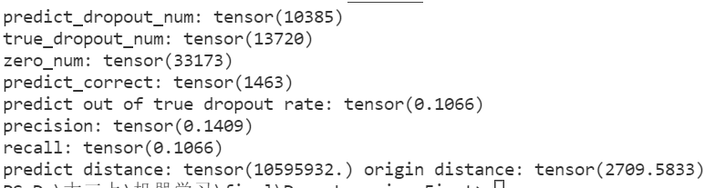

欧式距离：预测和真实数据之间的差异

差异非常大，明显看到欠拟合


训练2000轮次：

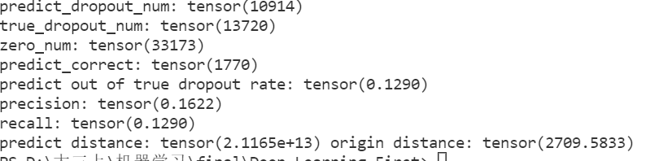

仍然是欠拟合


训练3000轮次：

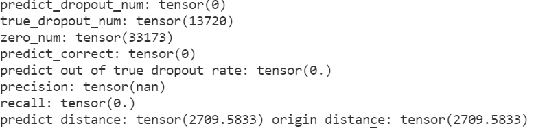

梯度爆炸

##### 模型二：hasBN=True zinb_new=False

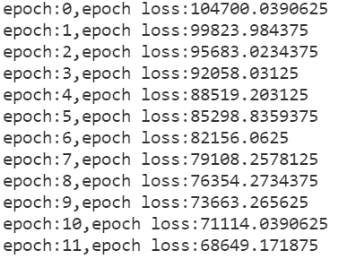

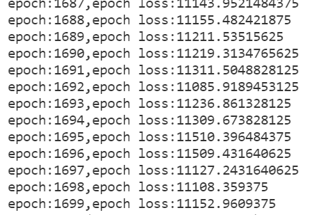

训练1000轮：

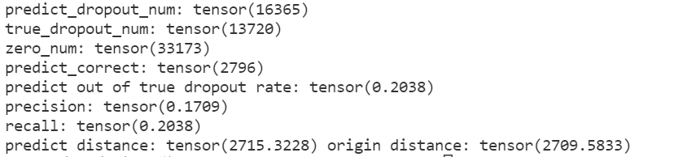

训练2000轮：

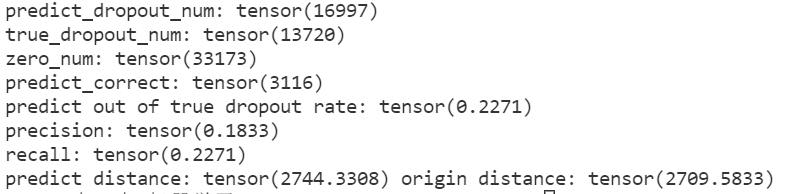

训练3000轮：

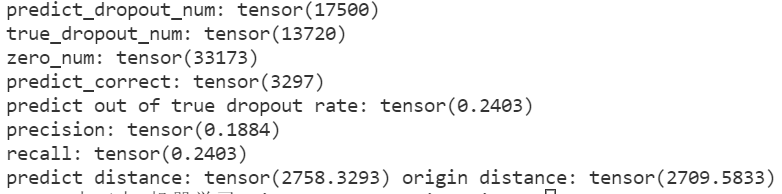

##### 模型三：hasBN=False zinb_new=True

训练3000轮次：

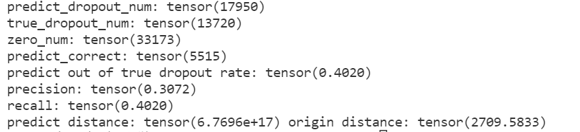

##### 模型四：hasBN=True zinb_new=True


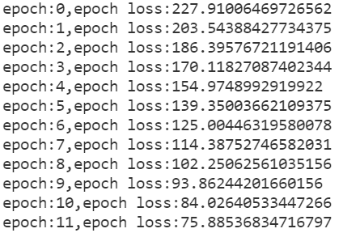

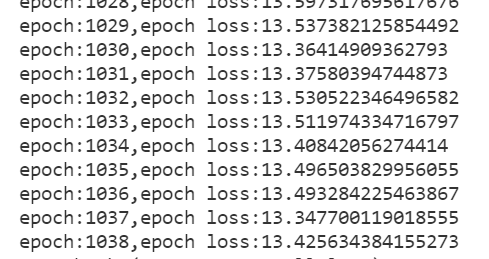

训练1000轮：

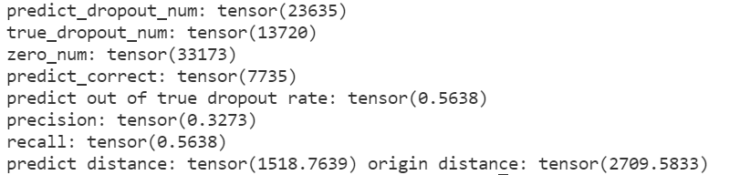

训练2000轮：

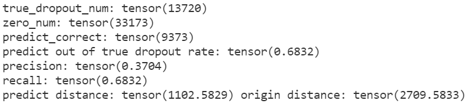

训练3000轮：

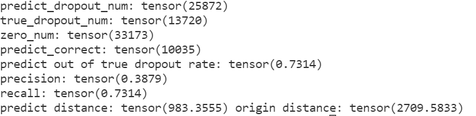


#### 结论：模型四效果最优，新的zinb损失函数更优，使用batchNormLd层比不使用更优。


#### 在验证集上验证

均选择3000轮次后训练得到的pkl进行predict

##### 模型1：

由于模型一过差,3000轮次过后直接梯度爆炸，所以不具有比较意义，在这里不列出结果。

##### 模型2：

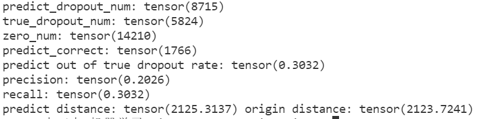

##### 模型3：

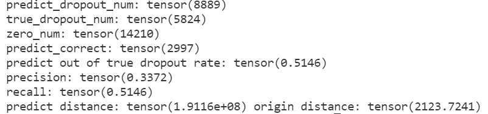

##### 模型4：

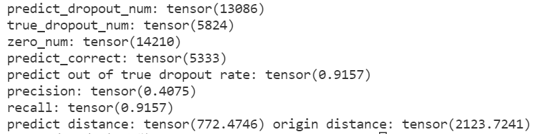


可以看到确实是模型4效果最好，precision和recall值都最高，且predict distance值最低（与true_data的差异最小）。

#### 高级要求

对于data.csv的补插和生成data.csv的模拟真实数据集相比获得较好效果(dropout率变小，表达差异变小) 。

我们在通读论文后觉得有些部分所描述的实验效果按照其所叙述方法浮现多次仍难以达到，故找到了其源码，发现与其文字描述有一定的出入，故按照其方法重新实现了损失函数的计算算法和训练网络的训练方法，其代码如下

```python
class LZINBLoss(nn.Module):
    def __init__(self, eps=1e-6):
        super().__init__()
        self.eps = eps

    def forward(self, X: Tensor, PI: Tensor = None, M: Tensor = None, THETA: Tensor = None):
        # 防止出现除0，log(0) log (负数) 等等等
        eps = self.eps
        # deal with inf
        max1 = max(THETA.max(), M.max())
        if THETA.isinf().sum() != 0:
            THETA = torch.where(THETA.isinf(), torch.full_like(THETA, max1), THETA)
        if M.isinf().sum() != 0:
            M = torch.where(M.isinf(), torch.full_like(M, max1), M)


        if PI.isnan().sum() != 0:
            PI = torch.where(PI.isnan(), torch.full_like(PI, eps), PI)
        if THETA.isnan().sum() != 0:
            THETA = torch.where(THETA.isnan(), torch.full_like(THETA, eps), THETA)
        if M.isnan().sum() != 0:
            M = torch.where(M.isnan(), torch.full_like(M, eps), M)

        # 之前的
        # lnb = lgamma(X + THETA + eps) - lgamma(THETA + eps) + \
        #       THETA * (torch.log(THETA + eps) - torch.log(M + THETA + eps)) + \
        #       X * (torch.log(M + eps) - torch.log(M + THETA + eps))
        # lnb = torch.where(lnb > 0, torch.full_like(lnb, 0.), lnb)
        # assert (lnb > 0).sum() == 0, 'ln(nb) greater than 0'
        # nb = torch.exp(lnb)
        # zinb_nonZeroCase = (1 - PI) * nb + eps
        # zinb_zeroCase = PI + (1 - PI) * nb + eps
        # zinb = torch.where(torch.less(X, 1e-10), zinb_zeroCase, zinb_nonZeroCase)
        # # python 有链式比较！！！
        # # 等价于 0 < zinb and zinb <= 1(概率值)
        # assert (zinb <= 0).sum() >= 0, 'zinb less than 0'
        # assert (zinb > 1.1).sum() >= 0, 'zinb bigger than 1.1'
        # # 最大化概率密度 即 最小化负概率密度 即 最小化loss
        # loss = torch.log(zinb).sum()
        # loss = -loss
        # return loss

        eps = torch.tensor(1e-10)
        # 事实上u即为y_pred，即补差的值
        # 注意是负对数，因此我们可以将乘法和除法变为加减法，
        THETA = torch.minimum(THETA, torch.tensor(1e6))
        t1 = torch.lgamma(THETA + eps) + torch.lgamma(X + 1.0) - torch.lgamma(X + THETA + eps)
        t2 = (THETA + X) * torch.log(1.0 + (M / (THETA + eps))) + (X * (torch.log(THETA + eps) - torch.log(M + eps)))
        nb = t1 + t2
        nb = torch.where(torch.isnan(nb), torch.zeros_like(nb) + max1, nb)
        nb_case = nb - torch.log(1.0 - PI + eps)
        zero_nb = torch.pow(THETA / (THETA + M + eps), THETA)
        zero_case = -torch.log(PI + ((1.0 - PI) * zero_nb) + eps)
        res = torch.where(torch.less(X, 1e-8), zero_case, nb_case)
        res = torch.where(torch.isnan(res), torch.zeros_like(res) + max1, res)
        return torch.mean(res)
```

```python
def train(EPOCH_NUM=100, print_batchloss=False, autoencoder=None, loader=None, startEpoch=0):
    """

    :param print_batchloss: 是否打印batch训练信息，默认为 False 否
    """
    opt = Adam(autoencoder.parameters(), lr=LR, betas=(BETA1, BETA2), eps=EPS, weight_decay=WEIGHT_DECAY)
    # opt = SGD(autoencoder.parameters(), lr=1e-2, momentum=0.8)
    mean_loss=0
    for epoch in range(EPOCH_NUM+1):
        epoch_loss = 0

        for batch, batch_data in enumerate(loader):
            # 一个batch拿32条数据
            opt.zero_grad()
            train_batch = batch_data[0]
            # 论文内容 照着实现
            # d是原始计数矩阵
            d = train_batch
            # norm_d是经过处理的数据
            # norm_d = train_batch[:, :, 1]
            # 正向传播计算损失函数当前值
            PI, M, THETA = autoencoder(d)
            templ = lzinbloss(d, PI, M, THETA)
            epoch_loss += templ
            if print_batchloss:
                print(f'epoch:{epoch+startEpoch},batch:{batch},batch loss:{templ},(batch size {BATCHSIZE})')
                f.write(f'epoch:{epoch+startEpoch},batch:{batch},batch loss:{templ},(batch size {BATCHSIZE})\n')
            # 反向传播计算梯度
            templ.backward()
            clip_grad_norm_(autoencoder.parameters(), max_norm=5, norm_type=2)
            # 梯度下降
            opt.step()
        # mean_loss+=epoch_loss
        # if epoch % 100 ==0:
        #     mean_loss=mean_loss/100
        print(f'epoch:{epoch+startEpoch},epoch loss:{epoch_loss}')
        f.write(f'epoch:{epoch+startEpoch},epoch loss:{mean_loss}\n')
        # mean_loss=0
        if epoch % EVER_SAVING == 0 and epoch!=0: torch.save(autoencoder.state_dict(), open(f'0113epoch{epoch+startEpoch}.pkl', 'wb'))
        # if epoch % EVER_SAVING == 0 and epoch!= 0 : torch.save(autoencoder.state_dict(), open(f'0113epoch{epoch+startEpoch}withoutBN.pkl', 'wb'))

```

经过该改进算法，在测试集上进行测试，其效果如下。可以看出，


我们利用最终改进的算法，对data进行补插，存入result.csv中（见压缩包）。
