# 机器学习大作业

> 赵一林 1910874 朱浩泽 1911530 王子莼 1911575 


## 1. 实验描述

​	单细胞转录组数据补插。单细胞RNA在表达时，对基因的表达情况进行测量，但在测量时有些部分可能无法准确测出是否表达，便记为0，但也有一部分基因本身就不会表达，即真实值便为0。所以我们要做的工作便是使用DCA对单细胞RNA-seq去噪，即判断哪些部位的基因是因为测量问题而导致的数据值为0的情况，而非实际未表达，并将这一部分的值算出填入相应位置。


## 2. 实验要求

- 基本要求

  将test_data.csv,test_truedata.csv分为测试集和验证集。实现任意补插算法来对数据集data.csv进行补插。使用测试集确定一个较好的模型，并使用验证集验证。针对你的模型和实验写一份报告，并提交源码(说明运行环境)和可执行文件。(建议使用神经网络)

- 中级要求

  在test_data.csv上获得一定效果(dropout率变小，表达差异变小) 。在别人理论的基础上进行一些自己的修改。

- 高级要求

  对于data.csv的补插和生成data.csv的模拟真实数据集相比获得较好效果(dropout率变小，表达差异变小) 。
  
  

## 3. 实验原理

​	以下图片是DCA的神经网络示意图

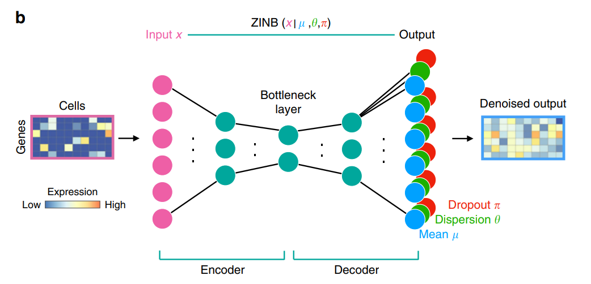

根据以下数学公式，可以复现DCA的神经网络模型。


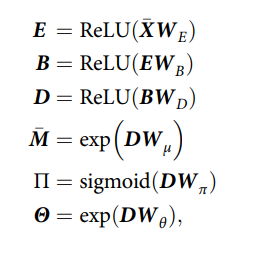

- 输入：计数矩阵A

  $A_{ij}$表示第i个基因在第j个细胞中的表达量

- 隐藏层：

  上图中E，B，D分别代表编码层，瓶颈层和译码层。

  除瓶颈层外所有的隐藏层（也就是编码层和译码层）都包含64个神经元，瓶颈层有32个神经元。

- 输出：每一个基因的三个参数 (μ, θ, π) 即（mean,dispersion,dropout的概率）

  同时也对应着ZINB分布的三个参数

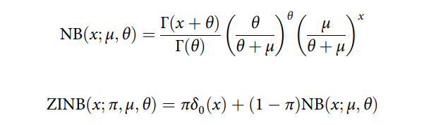


## 4. 实验代码

​	本次实验，我们在探索训练并尝试提升效果的过程中逐步构造了4组模型。4组模型是循序渐进的，简单描述如下：

1. 完全按照论文内容实现Autoencoder的bottleneck结构和zinb负对数概率密度函数。

2. 在1的基础上，在Autoencoder的神经网络中加入Batchnormalization层，仍采用论文理论的zinb损失函数

3. 在2的基础上，使用dca论文配套代码所实现的zinb损失函数。


​	这三个模型在源代码中均有体现，供读者选择以进行实验判断。此处将贴出最终版本的代码，并简要介绍。本次实验代码的目录结构介绍如下：	

​	 Autoencoder.py

>该文件实现了所有不同dca神经网络结构及zinb损失函数。

​	 trainer.py

>该文件实现了在训练集上训练及在data.csv上训练。

​     predict.py

>该文件实现了使用训练好的模型进行预测以及若干指标的计算。

​	下面将分函数及类介绍核心代码


### 4.1 数据预处理：preprocess_data函数

​	此函数用于实现下列公式，通过原始计数矩阵来计算输入给Autoencoder的zscore处理后计数矩阵。

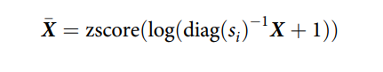

​	代码如下：

```python
def preprocess_data(data: Tensor):
    """
    预处理数据 按照X-bar公式 zscore处理
    :param data:
    :return: 处理得到的数据
    """
    s = torch.sum(data,dim=1)
    median = torch.median(s)
    s = s/median
    s = torch.inverse(torch.diag(s))
    norm_data = torch.matmul(s, data) + 1
    norm_data = torch.log(norm_data)
    norm_data = (norm_data - norm_data.mean()) / norm_data.std()
    return norm_data
```

### 4.2 DCA深度神经网络：Autoencoder类

​	该类继承自nn.Module，用于实现dca神经网络。此处根据论文，实现了最基本的dca网络，即一个含有bottleneck结构的Autoencoder和输出计数矩阵对应的三个参数矩阵的输出层。之后又加入了BatchNormalization层，用传入的超参数hasBN来决定是否需要使用BN层。THETA和M的激活函数都是exp，因为他们都是非负值。PI使用sigmoid作为激活函数，因为它是所估计的dropout的概率，应该在0和1之间

```python
class AutoEncoder(nn.Module):
    def __init__(self, input_size=None, hasBN=False):
        """
        :param input_size:
        """
        super().__init__()
        self.intput_size = input_size
        self.hasBN=hasBN
        self.input = Linear(input_size, 64)
        self.bn1 = BatchNorm1d(64)
        self.encode = Linear(64, 32)
        self.bn2 = BatchNorm1d(32)
        self.decode = Linear(32, 64)
        self.bn3 = BatchNorm1d(64)
        self.out_put_PI = Linear(64, input_size)
        self.out_put_M = Linear(64, input_size)
        self.out_put_THETA = Linear(64, input_size)
        self.reLu = nn.ReLU()
        self.sigmoid = nn.Sigmoid()

    def forward(self, x):
        x = preprocess_data(x)
        x = self.input(x)
        if self.hasBN:x = self.bn1(x)
        x = self.reLu(x)
        x = self.encode(x)
        if self.hasBN:x = self.bn2(x)
        x = self.reLu(x)
        x = self.decode(x)
        if self.hasBN:x = self.bn3(x)
        x = self.reLu(x)
        PI = self.sigmoid(self.out_put_PI(x))
        M = torch.exp(self.out_put_M(x))
        THETA = torch.exp(self.out_put_THETA(x))
        return PI, M, THETA
```

### 4.3 损失函数：LZINBLoss类


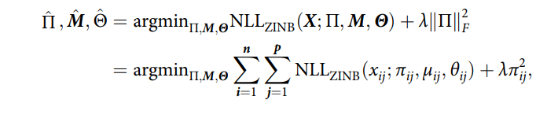

​	其中NLL是ZINB分布的负对数似然，ZINB公式如下:


​	选择ZINB分布是因为scRNA-seq数据的零值非常多，并选取其的负对数似然值作为其损失函数。当损失函数最小，ZINB的似然值最大，概率密度最大。我们要做的所谓训练，就是将损失函数不断降低，直到ZINB的似然值变得较大，此时概率密度较大且意味着概率较大，由此分析获得相对好的补插效果。

​	该类同样继承自nn.Module，用于实现本次dca网络训练的损失函数。损失函数有个版本：其一是完全按照论文内容实现的零膨胀负二项分布的负对数损失函数。另一是按照原论文配套代码实现的ZINB损失函数（见报告最后高级提升部分）。通过超参数控制 blablabla

​	损失函数的代码如下：

```python
class LZINBLoss(nn.Module):
    def __init__(self, eps=1e-6):
        super().__init__()
        self.eps = eps

    def forward(self, X: Tensor, PI: Tensor = None, M: Tensor = None, THETA: Tensor = None):
        # 防止出现除0，log(0) log (负数) 等等等
        eps = self.eps
        # deal with inf
        max1 = max(THETA.max(), M.max())
        if THETA.isinf().sum() != 0:
            THETA = torch.where(THETA.isinf(), torch.full_like(THETA, max1), THETA)
        if M.isinf().sum() != 0:
            M = torch.where(M.isinf(), torch.full_like(M, max1), M)


        if PI.isnan().sum() != 0:
            PI = torch.where(PI.isnan(), torch.full_like(PI, eps), PI)
        if THETA.isnan().sum() != 0:
            THETA = torch.where(THETA.isnan(), torch.full_like(THETA, eps), THETA)
        if M.isnan().sum() != 0:
            M = torch.where(M.isnan(), torch.full_like(M, eps), M)

        # 之前的
        lnb = lgamma(X + THETA + eps) - lgamma(THETA + eps) + \
              THETA * (torch.log(THETA + eps) - torch.log(M + THETA + eps)) + \
              X * (torch.log(M + eps) - torch.log(M + THETA + eps))
        lnb = torch.where(lnb > 0, torch.full_like(lnb, 0.), lnb)
        assert (lnb > 0).sum() == 0, 'ln(nb) greater than 0'
        nb = torch.exp(lnb)
        zinb_nonZeroCase = (1 - PI) * nb + eps
        zinb_zeroCase = PI + (1 - PI) * nb + eps
        zinb = torch.where(torch.less(X, 1e-10), zinb_zeroCase, zinb_nonZeroCase)
        # python 有链式比较！！！
        # 等价于 0 < zinb and zinb <= 1(概率值)
        assert (zinb <= 0).sum() >= 0, 'zinb less than 0'
        assert (zinb > 1.1).sum() >= 0, 'zinb bigger than 1.1'
        # 最大化概率密度 即 最小化负概率密度 即 最小化loss
        loss = torch.log(zinb).sum()
        loss = -loss
        return loss
```

### 4.4 训练函数：train

​	接收一个autoencoder，即神经网络模型，和一个loader，即数据集loader。该训练函数使用mini_batch寻来你方法，进行由loader定义的mini_batch梯度下降训练。使用Adam优化器进行Adam算法梯度下降，向Adam传入的参数是本trainer.py文件的一些超参数。startEpoch是用于分次从不同的迭代训练结果开始训练的参数。超参数将会在实验进行及结果展示部分介绍各情况下训练的超参数。

```python
def train(EPOCH_NUM=100, print_batchloss=False, autoencoder=None, loader=None, startEpoch=0,ever_saving = EVER_SAVING):
    """

    :param print_batchloss: 是否打印batch训练信息，默认为 False 否
    """
    lzinbloss = LZINBLoss(eps=EPS)
    opt = Adam(autoencoder.parameters(), lr=LR, betas=(BETA1, BETA2), eps=EPS, weight_decay=WEIGHT_DECAY)
    # opt = SGD(autoencoder.parameters(), lr=1e-2, momentum=0.8)
    mean_loss=0
    for epoch in range(EPOCH_NUM+1):
        epoch_loss = 0

        for batch, batch_data in enumerate(loader):
            # 一个batch拿32条数据
            opt.zero_grad()
            # d是原始计数矩阵
            d = batch_data[0]
            # 论文内容 照着实现
            # 正向传播计算损失函数当前值
            PI, M, THETA = autoencoder(d)
            templ = lzinbloss(d, PI, M, THETA)
            epoch_loss += templ
            if print_batchloss:
                print(f'epoch:{epoch+startEpoch},batch:{batch},batch loss:{templ},(batch size {BATCHSIZE})')
                f.write(f'epoch:{epoch+startEpoch},batch:{batch},batch loss:{templ},(batch size {BATCHSIZE})\n')
            # 反向传播计算梯度
            templ.backward()
            # 截取最大梯度
            clip_grad_norm_(autoencoder.parameters(), max_norm=5, norm_type=2)
            # 梯度下降
            opt.step()

        print(f'epoch:{epoch+startEpoch},epoch loss:{epoch_loss}')
        f.write(f'epoch:{epoch+startEpoch},epoch loss:{mean_loss}\n')
        # mean_loss=0
        if epoch % ever_saving == 0 and epoch!=0: torch.save(autoencoder.state_dict(), open(f'0114epoch{epoch+startEpoch}.pkl', 'wb'))
        # if epoch % ever_saving == 0 and epoch!= 0 : torch.save(autoencoder.state_dict(), open(f'0113epoch{epoch+startEpoch}withoutBN.pkl', 'wb'))

```

### 4.5 预测与验证：predict.py

​	该类内根据指定文件名载入想要进行预测的数据，及其对应的真实数据。将已训练好的模型载入，并进行预测。预测过程是根据神经网络输出的PI矩阵对原计数矩阵中所有的0值进行判断，如果该位置上的PI值大于0.5则认为0膨胀的概率大于0.5，则认为此处发生了dropout事件，再填入$$\mu$$矩阵M在对应位置上的值进行补差。在这个过程中计算了以下指标：

1. 预测的dropout数量predict_dropout_num
2. 真实的dropout数量true_dropout_num
3. 真实数据当中0的个数zero_num。
4. 预测的dropout中占真实dropout的比例，即召回率(predict_dropout_mask*true_drop_out_mask).sum()/true_dropout_num

```python
import numpy as np
import pandas as pd
import torch
from torch.nn.utils import clip_grad_norm_

from Autoencoder import AutoEncoder, LZINBLoss, preprocess_data
from torch.optim import Adam, SGD
from torch.utils.data import DataLoader
from torch.utils.data import TensorDataset

# 超参数

EPS = 1e-9
FILE_NAME = 'test_data.csv'
TURE_FILE = 'test_truedata.csv'
STATE_DICT_FILE = '0114epoch1000.pkl'
autoencoder = AutoEncoder(1000,hasBN=True)
lzinbloss = LZINBLoss(eps=EPS)
data = pd.read_csv(FILE_NAME).astype('float32')
data = torch.from_numpy(data.values.T)
truedata = pd.read_csv(TURE_FILE).astype('float32')
truedata = torch.from_numpy(truedata.values.T)

if __name__ == '__main__':
    autoencoder.load_state_dict(torch.load(STATE_DICT_FILE))
    print(autoencoder)
    PI, M, THETA = autoencoder(data)
    iszero = data == 0
    predict_dropout_of_all = PI>0.5
    true_drop_out_mask = iszero*((truedata - data)!=0)
    predict_dropout_mask = iszero*predict_dropout_of_all
    after = torch.floor(torch.where(predict_dropout_mask,M,data))
    zero_num = iszero.sum()
    true_dropout_num = true_drop_out_mask.sum()
    predict_dropout_num = predict_dropout_mask.sum()
    predict_correct = (predict_dropout_mask*true_drop_out_mask).sum()
    recall=predict_correct/true_dropout_num
    precision = predict_correct/predict_dropout_num
    print("predict_dropout_num:",predict_dropout_num,
          "\ntrue_dropout_num:", true_dropout_num,
          "\nzero_num:",zero_num,
          "\npredict_correct:",predict_correct,
          "\nprecision:",precision,
          "\nrecall:",recall)

    dif_after =  truedata - after
    dif_true = truedata - data
    # print(dif_after)
    # print(dif_true)
    print("predict distance:", torch.sqrt(torch.square(truedata - after).sum()).data,
          "origin distance:", torch.sqrt(torch.square(truedata - data).sum()).data)

```


## 5. 实验分析与实验结果展示

### 5.1初级要求和中级要求

- 将test_data.csv,test_truedata.csv分为测试集和验证集。实现任意补插算法来对数据集data.csv进行补插。使用测试集确定一个较好的模型，并使用验证集验证。针对你的模型和实验写一份报告，并提交源码(说明运行环境)和可执行文件。

- 在test_data.csv上获得一定效果(dropout率变小，表达差异变小) 。在别人理论的基础上进行一些自己的修改。

我们将test_data.csv,test_truedata.csv按照**7：3**的比例分为测试集和验证集。


#### 在测试集上测试四种模型

hasBN参数：有没有BatchNorm1d层

zinb_new参数：有没有使用改进后的zinb函数

##### 模型一：hasBN=False zinb_new=False

训练到后期梯度爆炸。

训练1000轮次：

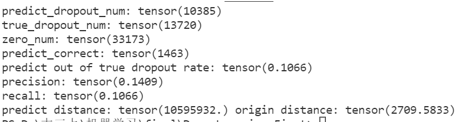

欧式距离：预测和真实数据之间的差异

差异非常大，明显看到欠拟合


训练2000轮次：

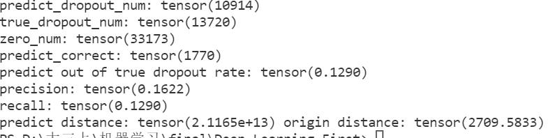

仍然是欠拟合


训练3000轮次：

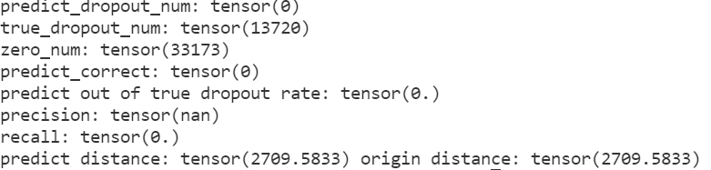

梯度爆炸

##### 模型二：hasBN=True zinb_new=False

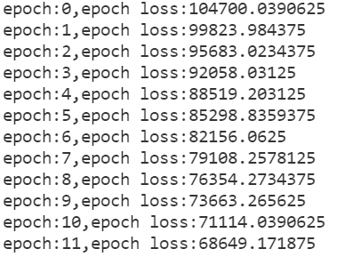

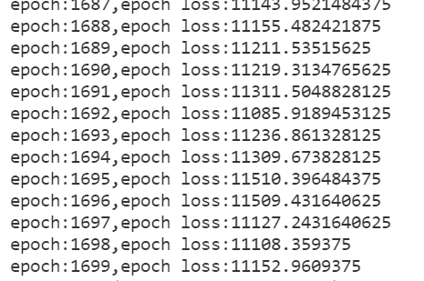

训练1000轮：

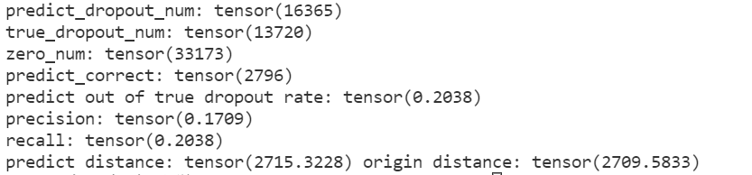

训练2000轮：

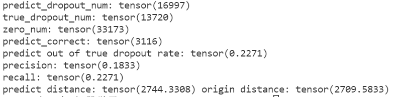

训练3000轮：

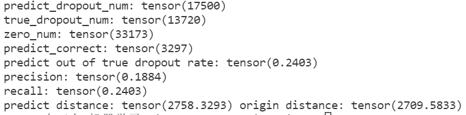

我们在通读论文后觉得有些部分所描述的实验效果按照其所叙述方法浮现多次仍难以达到，故找到了其源码，发现与其文字描述有一定的出入，故按照其方法重新实现了损失函数的计算算法和训练网络的训练方法（ZIBN），其代码如下

```python
class LZINBLoss(nn.Module):
    def __init__(self, eps=1e-6):
        super().__init__()
        self.eps = eps

    def forward(self, X: Tensor, PI: Tensor = None, M: Tensor = None, THETA: Tensor = None):
        # 防止出现除0，log(0) log (负数) 等等等
        eps = self.eps
        # deal with inf
        max1 = max(THETA.max(), M.max())
        if THETA.isinf().sum() != 0:
            THETA = torch.where(THETA.isinf(), torch.full_like(THETA, max1), THETA)
        if M.isinf().sum() != 0:
            M = torch.where(M.isinf(), torch.full_like(M, max1), M)


        if PI.isnan().sum() != 0:
            PI = torch.where(PI.isnan(), torch.full_like(PI, eps), PI)
        if THETA.isnan().sum() != 0:
            THETA = torch.where(THETA.isnan(), torch.full_like(THETA, eps), THETA)
        if M.isnan().sum() != 0:
            M = torch.where(M.isnan(), torch.full_like(M, eps), M)

        # 之前的
        # lnb = lgamma(X + THETA + eps) - lgamma(THETA + eps) + \
        #       THETA * (torch.log(THETA + eps) - torch.log(M + THETA + eps)) + \
        #       X * (torch.log(M + eps) - torch.log(M + THETA + eps))
        # lnb = torch.where(lnb > 0, torch.full_like(lnb, 0.), lnb)
        # assert (lnb > 0).sum() == 0, 'ln(nb) greater than 0'
        # nb = torch.exp(lnb)
        # zinb_nonZeroCase = (1 - PI) * nb + eps
        # zinb_zeroCase = PI + (1 - PI) * nb + eps
        # zinb = torch.where(torch.less(X, 1e-10), zinb_zeroCase, zinb_nonZeroCase)
        # # python 有链式比较！！！
        # # 等价于 0 < zinb and zinb <= 1(概率值)
        # assert (zinb <= 0).sum() >= 0, 'zinb less than 0'
        # assert (zinb > 1.1).sum() >= 0, 'zinb bigger than 1.1'
        # # 最大化概率密度 即 最小化负概率密度 即 最小化loss
        # loss = torch.log(zinb).sum()
        # loss = -loss
        # return loss

        # #final版本
        eps = torch.tensor(1e-10)
        # 事实上u即为y_pred，即补差的值
        # 注意是负对数，因此我们可以将乘法和除法变为加减法，
        THETA = torch.minimum(THETA, torch.tensor(1e6))
        t1 = torch.lgamma(THETA + eps) + torch.lgamma(X + 1.0) - torch.lgamma(X + THETA + eps)
        t2 = (THETA + X) * torch.log(1.0 + (M / (THETA + eps))) + (X * (torch.log(THETA + eps) - torch.log(M + eps)))
        nb = t1 + t2
        nb = torch.where(torch.isnan(nb), torch.zeros_like(nb) + max1, nb)
        nb_case = nb - torch.log(1.0 - PI + eps)
        zero_nb = torch.pow(THETA / (THETA + M + eps), THETA)
        zero_case = -torch.log(PI + ((1.0 - PI) * zero_nb) + eps)
        res = torch.where(torch.less(X, 1e-8), zero_case, nb_case)
        res = torch.where(torch.isnan(res), torch.zeros_like(res) + max1, res)
        return torch.mean(res)
```

```python
def train(EPOCH_NUM=100, print_batchloss=False, autoencoder=None, loader=None, startEpoch=0):
    """

    :param print_batchloss: 是否打印batch训练信息，默认为 False 否
    """
    opt = Adam(autoencoder.parameters(), lr=LR, betas=(BETA1, BETA2), eps=EPS, weight_decay=WEIGHT_DECAY)
    # opt = SGD(autoencoder.parameters(), lr=1e-2, momentum=0.8)
    mean_loss=0
    for epoch in range(EPOCH_NUM+1):
        epoch_loss = 0

        for batch, batch_data in enumerate(loader):
            # 一个batch拿32条数据
            opt.zero_grad()
            train_batch = batch_data[0]
            # 论文内容 照着实现
            # d是原始计数矩阵
            d = train_batch
            # norm_d是经过处理的数据
            # norm_d = train_batch[:, :, 1]
            # 正向传播计算损失函数当前值
            PI, M, THETA = autoencoder(d)
            templ = lzinbloss(d, PI, M, THETA)
            epoch_loss += templ
            if print_batchloss:
                print(f'epoch:{epoch+startEpoch},batch:{batch},batch loss:{templ},(batch size {BATCHSIZE})')
                f.write(f'epoch:{epoch+startEpoch},batch:{batch},batch loss:{templ},(batch size {BATCHSIZE})\n')
            # 反向传播计算梯度
            templ.backward()
            clip_grad_norm_(autoencoder.parameters(), max_norm=5, norm_type=2)
            # 梯度下降
            opt.step()
        # mean_loss+=epoch_loss
        # if epoch % 100 ==0:
        #     mean_loss=mean_loss/100
        print(f'epoch:{epoch+startEpoch},epoch loss:{epoch_loss}')
        f.write(f'epoch:{epoch+startEpoch},epoch loss:{mean_loss}\n')
        # mean_loss=0
        if epoch % EVER_SAVING == 0 and epoch!=0: torch.save(autoencoder.state_dict(), open(f'0113epoch{epoch+startEpoch}.pkl', 'wb'))
        # if epoch % EVER_SAVING == 0 and epoch!= 0 : torch.save(autoencoder.state_dict(), open(f'0113epoch{epoch+startEpoch}withoutBN.pkl', 'wb'))


```

利用上述新损失函数进行测试

##### 模型三：hasBN=False zinb_new=True

训练3000轮次：

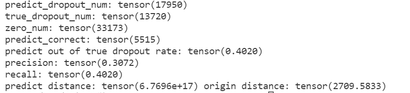

##### 模型四：hasBN=True zinb_new=True


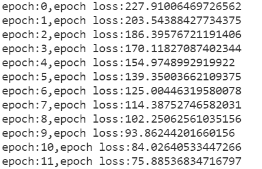

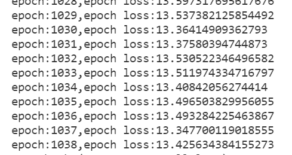

训练1000轮：

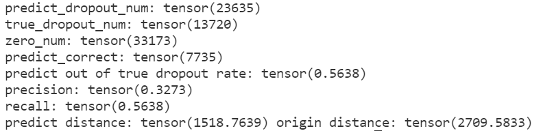

训练2000轮：

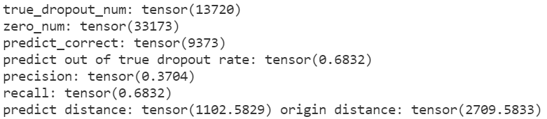

训练3000轮：

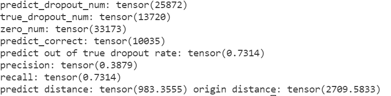


#### 结论：模型四效果最优，新的zinb损失函数更优，使用batchNormLd层比不使用更优。


#### 在验证集上验证

均选择3000轮次后训练得到的pkl进行predict

##### 模型1：

由于模型一过差,3000轮次过后直接梯度爆炸，所以不具有比较意义，在这里不列出结果。

##### 模型2：

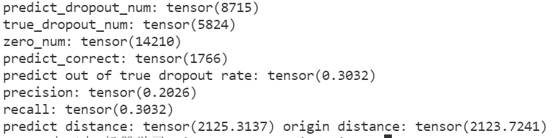

##### 模型3：

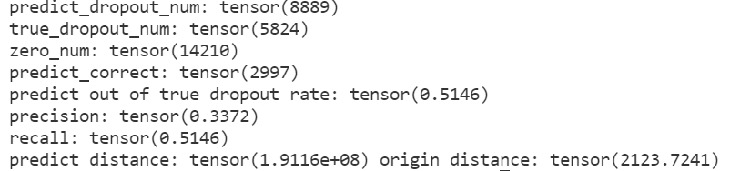

##### 模型4：

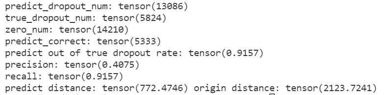


可以看到确实是模型4效果最好，precision和recall值都最高，且predict distance值最低（与true_data的差异最小）。


#### 5.2 高级要求

对于data.csv的补插和生成data.csv的模拟真实数据集相比获得较好效果(dropout率变小，表达差异变小) 。

我们利用最终改进的算法，对data进行补插，其结果如下，补差后的数据存入result.csv中（见压缩包）。

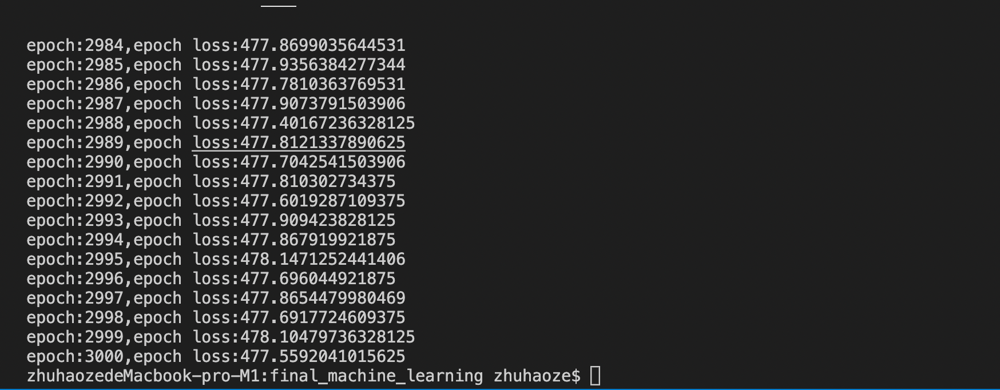

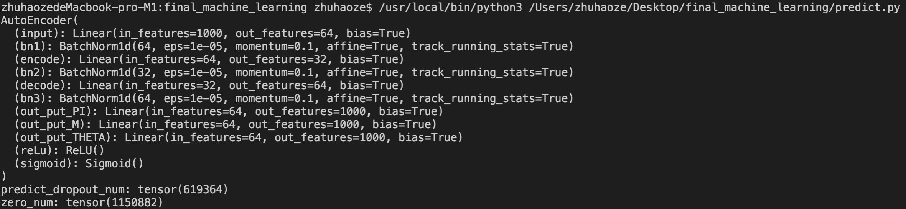

