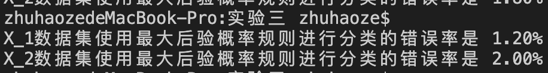
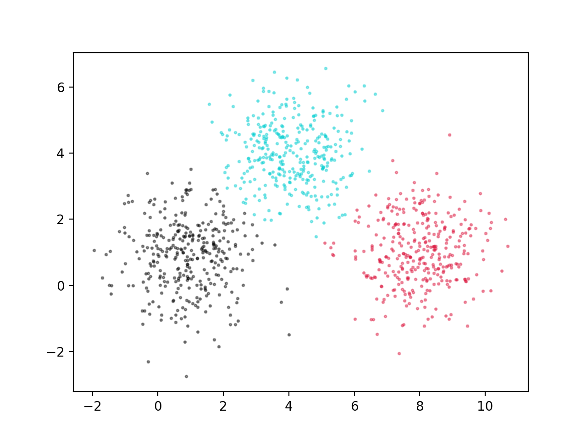
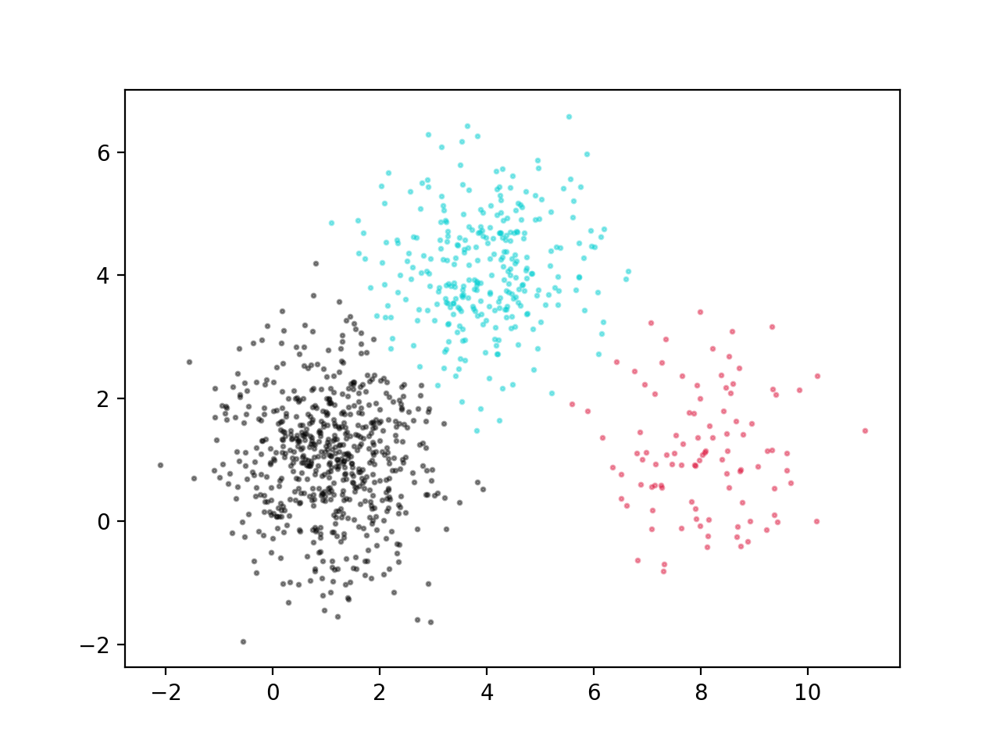
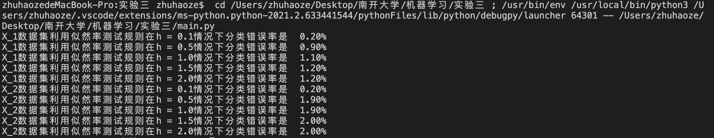

# 实验三:参数估计与非参数估计

> 朱浩泽 1911530 计算机科学与技术

## 实验要求

**基本要求 (3’)**

在两个数据集合上应用“最大后验概率规则” 进行分类实验，计算分类错误率，分析实验结果。 

**中级要求 (2’)**
在两个数据集合上使用高斯核函数估计方法，应用“似然率测试规则”分类，在 [0.1, 0.5, 1, 1.5, 2] 范围内交叉验证找到最优 h 值，分析实验结果。 

**提高要求**

在两个数据集合上使用进行k-近邻概率密度估计，计算并分析 k=1，3，5 时的概率密度估计结果。

**拓展要求**

在两个数据集合上应用“贝叶斯规则” 进行分类实验，计算分类错误率，分析实验结果。

## 数据集生成

数据: 生成两个各包含 N=1000 个二维随机矢量的数据集合 $X_1$ 和 $X_2$，数据集合中随机矢量 来自于三个分布模型，分别满足均值矢量 $m1 = [1,1]^T$,$m2 = [4,4]^T$, $m3 = [8,1]^T $和协方差矩阵S1 =S2 =S3 =2I，其中I是2×2的单位矩阵。在生成数据集合X时，假设来自三个 分布模型的先验概率相同 p(w1) = p(w2) = p(w3) = 1/3;而在生成数据集合 X ' 时，先验概率分别为 p(w1) = 0.6, p(w2) = 0.3, p(w3) = 0.1。

利用numpy包下的random.multivariate_normal函数进行生成，代码如下

```python
import numpy as np 
import matplotlib.pyplot as plt
import math 
def f(m, cnt):
    x = [] 
    y = []
    for i in range(cnt):
        x.append(m[i][0])
        y.append(m[i][1])
    return x, y

def random_x(cnt1, cnt2, cnt3, name): 
    cov = [[1, 0], [0, 1]]
    a1 = np.random.multivariate_normal((1, 1), cov, cnt1)
    a2 = np.random.multivariate_normal((4, 4), cov, cnt2)
    a3 = np.random.multivariate_normal((8, 1), cov, cnt3)
    colors0 = '#000000'
    colors1 = '#00CED1' #点的颜色
    colors2 = '#DC143C'
    area = np.pi   # 点面积
    x, y = f(a1, cnt1)
    plt.scatter(x, y, s=area, c=colors0, alpha=0.4)
    x, y = f(a2, cnt2)
    plt.scatter(x, y, s=area, c=colors1, alpha=0.4)
    x, y = f(a3, cnt3)
    plt.scatter(x, y, s=area, c=colors2, alpha=0.4)
    ls = []
    result = []
    for i in range(cnt1):
        ls.append(a1[i])
        result.append(1)
    for i in range(cnt2):
        ls.append(a2[i])
        result.append(2)
    for i in range(cnt3):
        ls.append(a3[i])
        result.append(3)
    plt.figure(num = name) 
    return ls, result

x1, c1 = random_x(333, 333, 334, "X_1数据集散点图")
x2, c2 = random_x(600, 300, 100, "X_2数据集散点图")

```

生成的数据散点图如下（左图为X，右图为X‘）：


## 利用“最大后验概率规则” 进行分类实验

1. 根据概率密度公式$\frac{1}{\sqrt{2 \pi}\sigma}e^{-\frac{(\theta-u)^2}{2\sigma. ^2}}$进行计算

   ```python
   def Normal_distribution(data, m):
       m = np.array(m)
       cov = np.array([[1, 0], [0, 1]])
       return 1 / math.sqrt((2 * np.pi) ** 2 * 1) * math.exp(-0.5 * np.dot((data - m).T, (data - m))) 
   ```

2. 将带入概率密度得到的最大的值分到此类

   ```python
   def Classification(data, mean1, mean2, mean3):
       result = []
       for d in data:
           t1 = Normal_distribution(d, mean1)
           t2 = Normal_distribution(d, mean2)
           t3 = Normal_distribution(d, mean3)
           i = 1
           max = t1
           if t2 > max:
               max = t2
               i = 2
           if t3 > max:
               max = t3
               i = 3
           result.append(i)
       return result
   ```

3. 计算准确率并画出散点图进行对比

   ```python
   def simrate(ls1, ls2):
       num = 0
       l = len(ls1)
       for i in range(l):
           if ls1[i] != ls2[i]:
               num += 1
       return format(num / l, '.2%') 
   
   def show_result(data, result, name):
       colors0 = '#000000'
       colors1 = '#00CED1' #点的颜色
       colors2 = '#DC143C'
       area = np.pi   # 点面积
       x1 = []
       x2 = []
       x3 = []
       y1 = []
       y2 = []
       y3 = []
       for i in range(len(data)):
           if result[i] == 1:
               x1.append(data[i][0])
               y1.append(data[i][1])
           elif result[i] == 2:
               x2.append(data[i][0])
               y2.append(data[i][1])
           elif result[i] == 3:
               x3.append(data[i][0])
               y3.append(data[i][1])
       plt.scatter(x1, y1, s=area, c=colors0, alpha=0.4)
       plt.scatter(x2, y2, s=area, c=colors1, alpha=0.4)
       plt.scatter(x3, y3, s=area, c=colors2, alpha=0.4)
       plt.figure(num = name)
   
   result1 = Classification(x1, (1, 1), (4, 4), (8, 1))
   result2 = Classification(x2, (1, 1), (4, 4), (8, 1))
   
   Error_rate1 = simrate(result1, c1)
   Error_rate2 = simrate(result2, c2)
   
   show_result(x1, result1, "X_1最大后验概率规则分类图")
   show_result(x2, result2, "X_2最大后验概率规则分类图")
   
   
   plt.show()
   
   print("\nX_1数据集使用最大后验概率规则进行分类的错误率是", Error_rate1)
   print("X_2数据集使用最大后验概率规则进行分类的错误率是", Error_rate2)
   ```

## 应用“似然率测试规则”分类

1. 根据概率密度公式$\frac{1}{N}\sum^N_{n=1}\frac{1}{\sqrt{2\pi h^2}}exp\{-\frac{||x-x_n||^2}{2h^2}\}$进行计算

   ```python
   def guss(x, data, h):
       n = len(data)
       result = 0
       for i in range(n):
           result += math.exp(- (math.sqrt((x[0] - data[i][0]) ** 2 + (x[1] - data[i][1]) ** 2)) / (2 * h * h))
       result = result / (n * math.sqrt(2 * np.pi * h * h))
       return result
   
   ```

2. 将带入概率密度得到的最大的值分到此类

   ```python
   def Classification_2(data, m1, m2, m3, h, r):
       result = []
       data1 = data[0 : m1]
       data2 = data[m1 : m1+m2]
       data3 = data[m1+m2 : m1+m2+m3]
       for d in data:
           t1 = guss(d, data1, h)
           t2 = guss(d, data2, h)
           t3 = guss(d, data3, h)
           i = 1
           max = t1
           if t2 > max:
               max = t2
               i = 2
           if t3 > max:
               max = t3
               i = 3
           result.append(i)
       return simrate(result, r)
   ```

3. 进行分类并打印结果

   ```python
   r1_1 = Classification_2(x1, 334, 333, 333, 0.1, c1)
   r1_5 = Classification_2(x1, 334, 333, 333, 0.5, c1)
   r1_10 = Classification_2(x1, 334, 333, 333, 1, c1)
   r1_15 = Classification_2(x1, 334, 333, 333, 1.5, c1)
   r1_20 = Classification_2(x1, 334, 333, 333, 2, c1)
   
   r2_1 = Classification_2(x2, 600, 300, 100, 0.1, c2)
   r2_5 = Classification_2(x2, 600, 300, 100, 0.5, c2)
   r2_10 = Classification_2(x2, 600, 300, 100, 1, c2)
   r2_15 = Classification_2(x2, 600, 300, 100, 1.5, c2)
   r2_20 = Classification_2(x2, 600, 300, 100, 2, c2)
   print("X_1数据集利用似然率测试规则在h = 0.1情况下分类错误率是 ", r1_1)
   print("X_1数据集利用似然率测试规则在h = 0.5情况下分类错误率是 ", r1_5)
   print("X_1数据集利用似然率测试规则在h = 1.0情况下分类错误率是 ", r1_10)
   print("X_1数据集利用似然率测试规则在h = 1.5情况下分类错误率是 ", r1_15)
   print("X_1数据集利用似然率测试规则在h = 2.0情况下分类错误率是 ", r1_20)
   
   print("X_2数据集利用似然率测试规则在h = 0.1情况下分类错误率是 ", r2_1)
   print("X_2数据集利用似然率测试规则在h = 0.5情况下分类错误率是 ", r2_5)
   print("X_2数据集利用似然率测试规则在h = 1.0情况下分类错误率是 ", r2_10)
   print("X_2数据集利用似然率测试规则在h = 1.5情况下分类错误率是 ", r2_15)
   print("X_2数据集利用似然率测试规则在h = 2.0情况下分类错误率是 ", r2_20)
   ```

## 实验结果

### 利用“最大后验概率规则” 进行分类实验

得出实验准确率如下：



画出散点图与原数据进行对比如下：

$X_1$原数据集（左）与利用最大后验概率进行分类后的$X_1$数据集（右）进行对比。



$X_2$原数据集（左）与利用最大后验概率进行分类后的$X_2$数据集（右）进行对比。



可以看出，利用“最大后验概率规则” 进行分类的错误率较低，且分类错误基本处于边缘或离中心较远的点，故该分类方法在此数据集下效果较好，可以采用。

### 应用“似然率测试规则”分类



可以看出，在应用“似然率测试规则”分类的实验中，窗口h的选择在较大取值将产生过度平滑的密度估计，模糊了数据的空间结构；较小取值将产生又⻓又尖的密度估计，解释比较困难。通过实验可以看出，在这两个数据集下窗口值为0.1时效果较好，此时的错误率在两数据集上均为0.2%。


