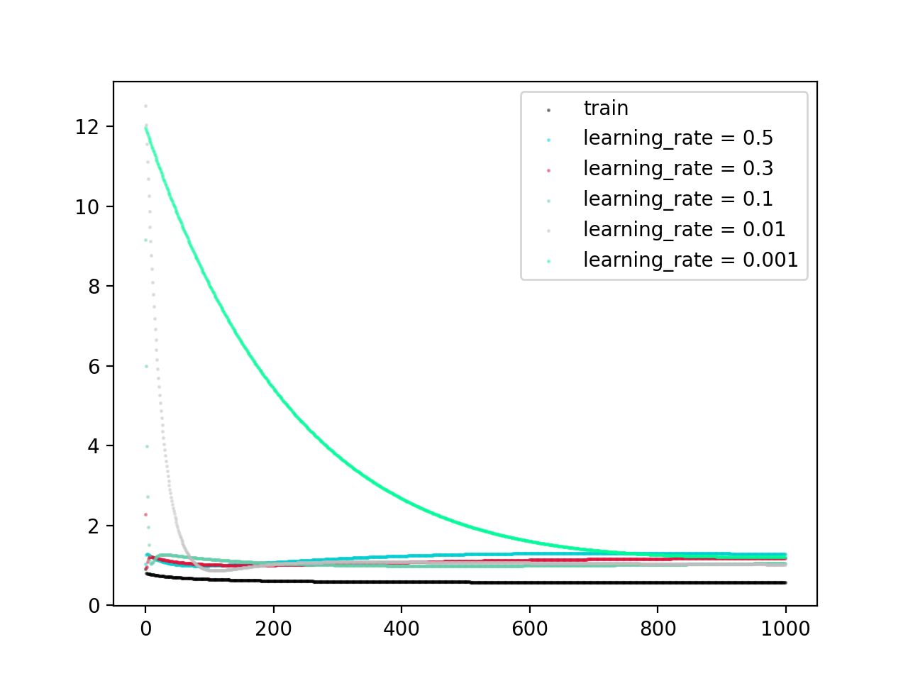

# 回归模型

> 朱浩泽 1911530 计算机科学与技术

## 实验描述

**实验基本要求**

- 根据数据集 dataset_regression.csv ，求最小二乘解，画出回归曲线，给出训练误差。

- 将数据集 winequality-white.csv 按照4:1划分为训练集和测试集，构造线性回归模型，采用批量梯度下降或者随机梯度下降均可;输出训练集和测试集的均方误差(MSE)，画出MSE收敛曲线。

**实验中级要求**

 尝试不同的学习率并进行MSE曲线展示，分析选择最佳的学习率。

## 具体分析

- 最小二乘法

  ```python
  import numpy as np 
  import matplotlib.pyplot as plt 
  import csv
  import operator
  with open('dataset_regression.csv') as csvfile:
       reader = csv.reader(csvfile)
       dataset = [row for row in reader]
  dataset.pop(0)
  for i in dataset:
      for m in range(3):
          i[m] = float(i[m])
  print(dataset)
  n = len(dataset)
  sum_xy = 0
  sum_x = 0
  sum_y = 0
  sum_xx = 0
  for i in range(n):
      sum_xy += dataset[i][1] * dataset[i][2]
      sum_x += dataset[i][1]
      sum_y += dataset[i][2]
      sum_xx += dataset[i][1] * dataset[i][1]
  a1 = (sum_xy - (sum_x * sum_y) / n) / (sum_xx - n * (sum_x / n  * sum_x / n))
  a0 = sum_y / n - a1 * sum_x / n
  a1 = round(a1, 4)
  a0 = round(a0, 1)
  print("回归方程为：y=", a1 , "x+" , a0)
  xt = []
  yt = []
  for i in dataset:
      xt.append(i[1])
      yt.append(i[2])
  loss = 0
  for i in range(n):
      loss += (yt[i] - a0 - a1 * xt[i]) ** 2
  loss = loss / (2 * n)
  print("loss的值为：", loss)
  fig = plt.figure(figsize=(4, 4))
  ax = fig.add_subplot(1, 1, 1)
  ax.scatter(xt, yt)
  x = np.arange(-3, 4)
  y = a1 * x + a0
  plt.plot(x, y)
  plt.show()
  ```

- 多维数据采用批量梯度下降构造模型

  在梯度下降前，先要对数据进行归一化处理

  学习率分别为0.5 0.3 0.1 0.01 0.001进行测试

  ```python
  import numpy as np 
  import csv
  import operator
  from sklearn.model_selection import train_test_split
  import matplotlib.pyplot as plt
  with open('winequality-white.csv') as csvfile:
       reader = csv.reader(csvfile)
       dataset = [row for row in reader]
  dataset.pop(0)
  y = []
  for i in dataset:
      for m in range(len(i)):
          i[m] = float(i[m])
      y.append(i[-1])
      i.pop(-1)
      i.insert(0, 1)
  x_train, x_test, y_train, y_test = train_test_split(dataset, y, test_size = 0.2) #划分训练集
  #归一化
  def feature_scaling(x):
      for i in range(len(x[0])):
          max = -float('inf')
          min = float('inf') 
          for m in range(len(x)):
              if x[m][i] > max:
                  max = x[m][i]
              if x[m][i] < min:
                  min = x[m][i]
          for m in range(len(x)):
              if max - min != 0:
                  x[m][i] = (x[m][i] - min) / (max - min)
      return x
  x_train = feature_scaling(x_train)
  x_test = feature_scaling(x_test)
  # theta = np.random.rand(len(x_train[0]))
  # print(x_train[0])
  # print(theta)
  # print(theta * x_train)
  # print(x_train)
  # print(type(np.random.rand(len(x_train))))
  def gradient_descent(x_train, y_train, x_test, y_test, learning_rate):
      loss = []
      theta = np.random.rand(len(x_train[0]))
      x_train = np.array(x_train)
      x_test = np.array(x_test)
      for index in range(1000):
          gradients = x_train.T.dot(x_train.dot(theta) - y_train) / len(x_train)
          theta = theta - learning_rate * gradients
          MSE = ((np.dot(x_test, theta) - y_test) ** 2).sum() / len(x_test)
          loss.append(MSE)
      return theta, loss
  ls = []
  for i in range(1000):
      ls.append(i)
  x = np.array(ls)
  theta0, loss0 = gradient_descent(x_train, y_train, x_train, y_train, learning_rate = 0.5)
  theta1, loss1 = gradient_descent(x_train, y_train, x_test, y_test, learning_rate = 0.5)
  theta2, loss2 = gradient_descent(x_train, y_train, x_test, y_test, learning_rate = 0.3)
  theta3, loss3 = gradient_descent(x_train, y_train, x_test, y_test, learning_rate = 0.1)
  theta4, loss4 = gradient_descent(x_train, y_train, x_test, y_test, learning_rate = 0.01)
  theta5, loss5 = gradient_descent(x_train, y_train, x_test, y_test, learning_rate = 0.001)
  # 画散点图
  colors0 = '#000000'
  colors1 = '#00CED1' #点的颜色
  colors2 = '#DC143C'
  colors3 = '#66CDAA'
  colors4 = '#BEBEBE'
  colors5 = '#00FA9A'
  area = np.pi * 0.5**2  # 点面积
  plt.scatter(x, loss0, s=area, c=colors0, alpha=0.4, label='train')
  plt.scatter(x, loss1, s=area, c=colors1, alpha=0.4, label='learning_rate = 0.5')
  plt.scatter(x, loss2, s=area, c=colors2, alpha=0.4, label='learning_rate = 0.3')
  # plt.scatter(x, loss3, s=area, c=colors3, alpha=0.4, label='learning_rate = 0.1')
  # plt.scatter(x, loss4, s=area, c=colors4, alpha=0.4, label='learning_rate = 0.01')
  # plt.scatter(x, loss5, s=area, c=colors5, alpha=0.4, label='learning_rate = 0.001')
  plt.legend()
  plt.show()
  ```

## 实验结果

- 最小二乘法

  

  

  - 梯度下降

    

    

​       通过实验数据可知，学习率过高或过低时都会影响模型准确率。学习率过高会导致过拟合，过低会导致欠拟合。分析可见，该模型最佳学习率在0.3左右。
