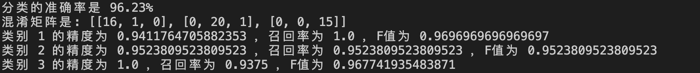

# 实验四:朴素贝叶斯分类器

> 朱浩泽 计算机科学与技术 1911530

## 实验要求

##### 数据集

Most Popular Data Set中的wine数据集（对意大利同一地区声场的三种不同品种的酒做大量分析所得出的数据）

##### 基本要求

a)采用分层采样的方式将数据集划分为训练集和测试集。 

b)给定编写一个朴素贝叶斯分类器，对测试集进行预测，计算分类准确率。

##### 中级要求

使用测试集评估模型，得到混淆矩阵，精度，召回率，F值。

##### 高级要求

在中级要求的基础上画出三类数据的ROC曲线，并求出AUC值。

##### 拓展要求

浅谈ROC曲线和AUC值作为分类评价的合理性。

## 实验代码及分析

1. 倒入库文件并读取数据集

   ```python
   import numpy as np 
   import math
   import random
   import csv
   import operator
   
   with open('wine.data') as csvfile:
        reader = csv.reader(csvfile)
        dataset = [row for row in reader]
   ```

2. 对读取的数据集进行处理并划分

   按照7:3的比例，采用分层抽样的方法划分测试集和训练集。由于我们的测试集和训练集读取时采用的是字符串类型的数据存储，还要转换成浮点类型。采用分层抽样方法划分完的训练集三类数据的数量分别是42、 50、 33。 

   ```python
   x_train = []
   y_train = []
   x_test = []
   y_test = []
   seed = []
   train = random.sample(dataset[0: 59], 42)
   train = train + random.sample(dataset[59: 59 + 71], 50)
   train = train + random.sample(dataset[59 + 71: -1], 33)
   test = [i for i in dataset if i not in train]
   
   def to_float(dataset):
       y = []
       for i in dataset:
           for m in range(len(i)):
               i[m] = float(i[m])
           y.append(int(i[0]))
           i.pop(0)
       return dataset, y
   
   x_train, y_train = to_float(train)
   x_test, y_test = to_float(test)
   ```

3. 计算概率密度函数

   $P(c|x)$：后验概率（在给定样本$x$的条件下，属于类别$c$的概率）。

   $P(x|c)$：假设在$c$类下，观察到样本$x$的概率。模式特征$𝑥$的似然函数（特征$x$来自于类别$c$的可能性）。

   $P(c)$：样本为类别$c$的先验概率。在实际应用中，先验概率都是未知的，只能通过背景知识、训练数据等来估计这些概率。这也是贝叶斯方法的难处之一。本题将其视为正态分布，其概率密度公式为$\frac{1}{\sqrt{2 \pi}\sigma}e^{-\frac{(x-u)^2}{2\sigma^2}}$

   ```python
   def Bayes(data, p, avg, var):
       result = p
       for i in range(len(data)):
           result *=  1 / (math.sqrt(2 * math.pi * var[i])) * math.exp(-((data[i] - avg[i])**2) / (2 * var[i]))
       return result
   ```

4. 分类

   通过计算后验概率，将测试集进行分类，并计算分类准确率

   ```python
   def classifier(x_train, x_test):
       result = []
       x_train = np.array(x_train)
       avg1 = x_train[:42].mean(axis = 0)
       var1 = x_train[:42].var(axis = 0)
       avg2 = x_train[42 : 42 + 50].mean(axis = 0)
       var2 = x_train[42 : 42 + 50].var(axis = 0)
       avg3 = x_train[42 + 50 : ].mean(axis = 0)
       var3 = x_train[42 + 50 : ].var(axis = 0)
       for i in range(len(x_test)):
           temp = 1
           max = Bayes(x_test[i], 59 / (59 + 71 + 48), avg1, var1)
           if Bayes(x_test[i], 71 / (59 + 71 + 48), avg2, var2) > max:
               temp = 2
               max = Bayes(x_test[i], 71 / (59 + 71 + 48), avg2, var2)
           if Bayes(x_test[i], 48 / (59 + 71 + 48), avg3, var3) > max:
               temp = 3
           result.append(temp)
       return result
     
   def simrate(ls1, ls2):
       num = 0
       l = len(ls1)
       for i in range(l):
           if ls1[i] == ls2[i]:
               num += 1
       return format(num / l, '.2%')
   
   predict = classifier(x_train, x_test)
   
   print("分类的准确率是", simrate(predict, y_test))
   ```

5. 生成混淆矩阵

   |         | 预测值1 | 预测值2 | 预测值3 |
   | ------- | ------- | ------- | ------- |
   | 实际值1 |         |         |         |
   | 实际值2 |         |         |         |
   | 实际值3 |         |         |         |

   ```python
   def confuse_maxtria(predict, fact):
       ls = [[0, 0, 0], [0, 0, 0], [0, 0, 0]]
       for i in range(len(predict)):
           ls[fact[i] - 1][predict[i] - 1] += 1
       return ls
   
   print("混淆矩阵是:", confuse_maxtria(predict, y_test))
   ```

6. 计算精度、召回率和F值

   True Positive(真正，TP)：将正类预测为正类数

   True Negative(真负，TN)：将负类预测为负类数

   False Positive(假正，FP)：将负类预测为正类数误报 (Type I error)

   False Negative(假负，FN)：将正类预测为负类数→漏报 (Type II error)

   精确率(precision)定义为 $p = \frac{TP}{TP + FP}$

   召回率(recall)定义为 $p = \frac{TP}{TP + FN}$

   F-Measure定义为 $F-Measure = \frac{(a^2+1)P * R}{P + R}$，本次实验中$a$值取为1

   ```python
   def get_feature(confuse_maxtria):
       for index in range(len(confuse_maxtria)):
           truth = confuse_maxtria[index][index]
           total = 0
           total2 = 0
           for i in range(len(confuse_maxtria)):
               total += confuse_maxtria[index][i]
           for i in range(len(confuse_maxtria)):
               total2 += confuse_maxtria[i][index]
           precision = truth / total
           recall = truth / total2
           f_rate = 2 * precision * recall / (precision + recall)
           print("类别", index + 1, "的精度为", precision, "，召回率为", recall, "，F值为", f_rate)
   
   get_feature(confuse_maxtria(predict, y_test))
   ```

   

## 实验结果展示


可以看出，本次实验正确率较高，各项指标较为优秀，分类结果理想。

